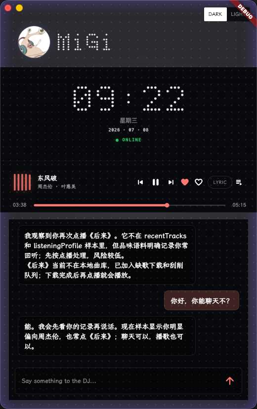
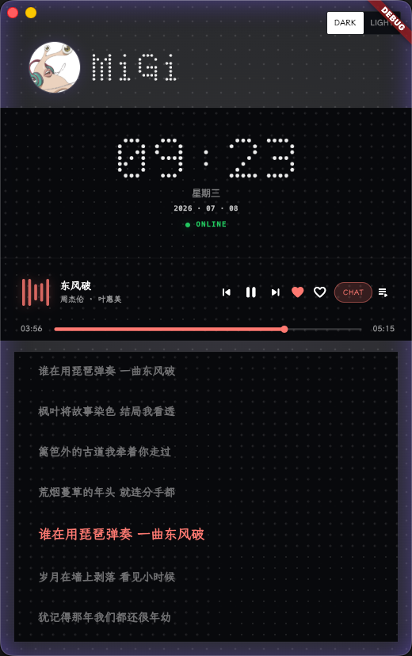
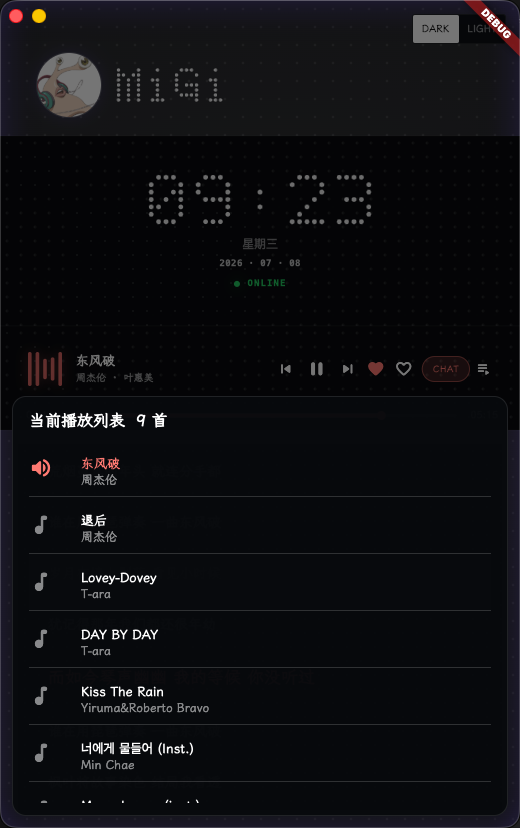
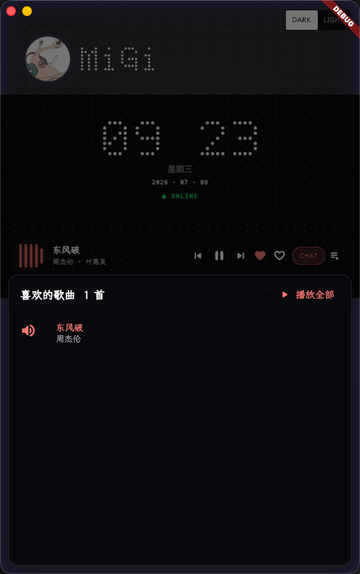

# 沐音 / Migi 私人音乐电台

这是一个面向个人 NAS 的音乐服务和 Flutter 客户端。现在项目重点已经收敛为：

- NAS 端扫描本地音乐、歌词、封面和播放记录。
- Flutter 客户端在 macOS、Android、iOS 上播放 NAS 音乐。
- Migi 作为私人 AI DJ，根据天气、日期、听歌记录和个人偏好生成口播。
- 播放时使用双音轨：主音乐继续播放，Migi 插话时自动压低音乐音量，口播结束后恢复。

灵感来源于 [mmguo](https://mmguo.dev/) 的私人 AI DJ / Claudio FM。感谢这个想法，它让我把“懂我的音乐电台”这件事真正做成了一个可以自用的应用。

## 截图

| 聊天点歌 | 歌词模式 |
| --- | --- |
|  |  |

| 播放列表 | 喜欢的歌曲 |
| --- | --- |
|  |  |

## 当前能力

### NAS 音乐服务

- 扫描多个本地音乐目录。
- 提供歌曲列表、搜索、音频流、封面、歌词接口。
- 记录本地播放、网易云导入、QQ 音乐截图/手动导入等听歌历史。
- 支持喜欢歌曲、播放列表、最近播放。
- 缺歌时可进入下载队列，下载完成后继续增量扫描。
- 缺少歌词或封面时可走自用刮削插件补齐。
- 提供 Migi DJ 接口：今日电台、聊天、口播音频、用户画像和播放计划。

### Flutter 客户端

- 竖屏主界面，适合 macOS 小窗和手机端复用。
- 黑色/白色主题切换。
- 点阵背景、Migi 头像、时间区域、播放控制和聊天区域。
- 支持歌词面板、聊天面板、播放列表弹层、喜欢列表弹层。
- 支持拖动进度条、上一首、下一首、喜欢/取消喜欢。
- 支持聊天点歌，例如“播放夜曲”“今天想听安静点的歌”。
- Migi 口播使用单独音轨播放，口播开始时主音乐 ducking 压低。

### AI 与语音

- 文案生成使用 OpenAI 兼容接口，当前默认接入 [0029 中转](https://www.0029.org/?promo=AFF1K9)。
- 口播语音使用 Fish Audio，当前默认模型为 `s2.1-pro-free`。
- 默认 Migi 声音 ID：`c43ae8e1c3664eac9203f9293fabc3c9`。
- 真实 API Key 只放在 NAS 数据卷的 secret env 文件中，不提交到仓库。

## 项目结构

```text
.
├── clients/mu-music/          # Flutter 客户端
├── services/agent-server/     # NAS 端 Python/FastAPI 服务
├── data/                      # 本地开发数据说明、env 示例
├── docs/                      # 文档和截图
├── memory/                    # 开发过程中的问题记录
├── docker-compose.yml         # NAS 部署编排
└── operateLog.md              # 迭代操作日志
```

## NAS 部署

在 NAS 上使用 Docker Compose：

```bash
docker compose up -d --build
```

当前 Compose 服务名：

- service：`music-server`
- container：`mu-music-server`
- 默认端口：`8088`

主要挂载目录：

```yaml
volumes:
  - /volume1/docker/mu-music/data:/data
  - /volume1/media/音乐:/data/media/daoliyu
  - /volume1/docker/sqmusic/file:/data/media/sqmusic
```

服务健康检查：

```bash
curl http://NAS_IP:8088/version
curl http://NAS_IP:8088/health
```

如果配置了 `AGENT_SERVER_USERNAME` 和 `AGENT_SERVER_PASSWORD`，访问 `/v1/*` 接口需要 Basic Auth：

```bash
curl -u "账号:密码" http://NAS_IP:8088/v1/dj/status
```

## Flutter 运行

```bash
cd clients/mu-music
flutter pub get
flutter run -d macos
```

Android 调试：

```bash
flutter run -d android
```

发布包示例：

```bash
flutter build macos --debug
flutter build apk --release --split-per-abi \
  --dart-define=NAS_LOCAL_API_URL=http://你的NAS局域网IP:8088/v1/music \
  --dart-define=NAS_PUBLIC_API_URL=https://你的域名/v1/music \
  --dart-define=AGENT_SERVER_USERNAME=你的账号 \
  --dart-define=AGENT_SERVER_PASSWORD=你的密码
```

客户端默认会优先尝试局域网 NAS 地址，局域网不可用时再尝试公网域名。

## 常用接口

公开接口：

- `GET /version`
- `GET /health`

需要认证的接口：

- `GET /v1/music/status`
- `POST /v1/music/api/admin/scan`
- `GET /v1/music/api/tracks`
- `GET /v1/music/audio/{track_id}`
- `GET /v1/music/radio/status`
- `GET /v1/dj/status`
- `GET /v1/dj/today`
- `POST /v1/dj/chat`
- `POST /v1/dj/tts/probe`
- `GET /v1/listening/profile`

## 密钥配置

正式部署时，真实密钥放在 NAS 数据卷：

```text
/volume1/docker/mu-music/data/secrets/agent-server.env
/volume1/docker/mu-music/data/secrets/music-sources.env
```

本地开发时可以放在：

```text
data/secrets/agent-server.env
data/secrets/music-sources.env
```

只提交 `*.env.example`，不要提交真实 `.env`。

常用配置项：

```env
AGENT_SERVER_USERNAME=
AGENT_SERVER_PASSWORD=
OPENAI_COMPAT_API_KEY=
FISH_API_KEY=
SQMUSIC_USERNAME=
SQMUSIC_PASSWORD=
```

## 开源边界

这个仓库只保留干净的 NAS 音乐服务、Flutter 客户端和接口框架。

不要提交：

- 真实 `.env` 文件。
- API Key、Token、Cookie。
- 个人 SQLite 数据库。
- 私有音乐源、下载源、刮削插件实现。
- QQ 音乐、网易云、酷狗、酷我等第三方平台的非公开抓取逻辑。
- Flutter/Android/macOS 构建产物。

第三方元数据刮削和下载能力应放在私有插件目录或 NAS 私有数据卷里，公开仓库只保留插件接口。

## 开发检查

服务端：

```bash
python3 -m py_compile services/agent-server/app/*.py
```

Flutter：

```bash
cd clients/mu-music
flutter analyze --no-fatal-infos --no-fatal-warnings
```

Compose 配置：

```bash
ruby -e 'require "yaml"; YAML.load_file("docker-compose.yml"); puts "yaml ok"'
```
